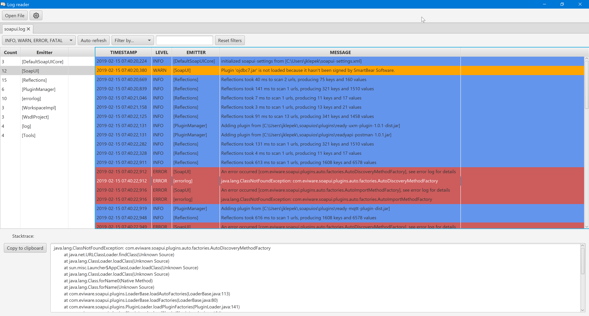

# LogReader
An application for reading log4j log files built on javafx. Log records are color coded according to their severity and can be filtered accordingly.
Application supports multiple opened files.
Each file can be automatically refreshed, if there are new records in it.
When log file is reset, log entries in application are refreshed to mirror the actual state.
Parent directory of each opened file is being watched and when there is a new .log file, notification will pop up.
For convenience, stacktrace can be copied to clipboard with a push of a button.
Settings allow to set initial directory and auto-refresh interval, which is stored in user preferences.
Multiple custom layout patterns can defined in settings like this "%D{yyyy-MM-dd' 'HH:mm:ss,SSS} %LEVEL %EMITTER %MESSAGE"
For now these keywords are supported: EMITTER, LEVEL, THREAD, MDC, MESSAGE and timestamp in SimpleDateFormat.
Events now can be filtered by selected property, or by double-clicking on an item in the emitters TreeTable.

Executable jar can be generated by running "mvn clean compile assembly:single"

